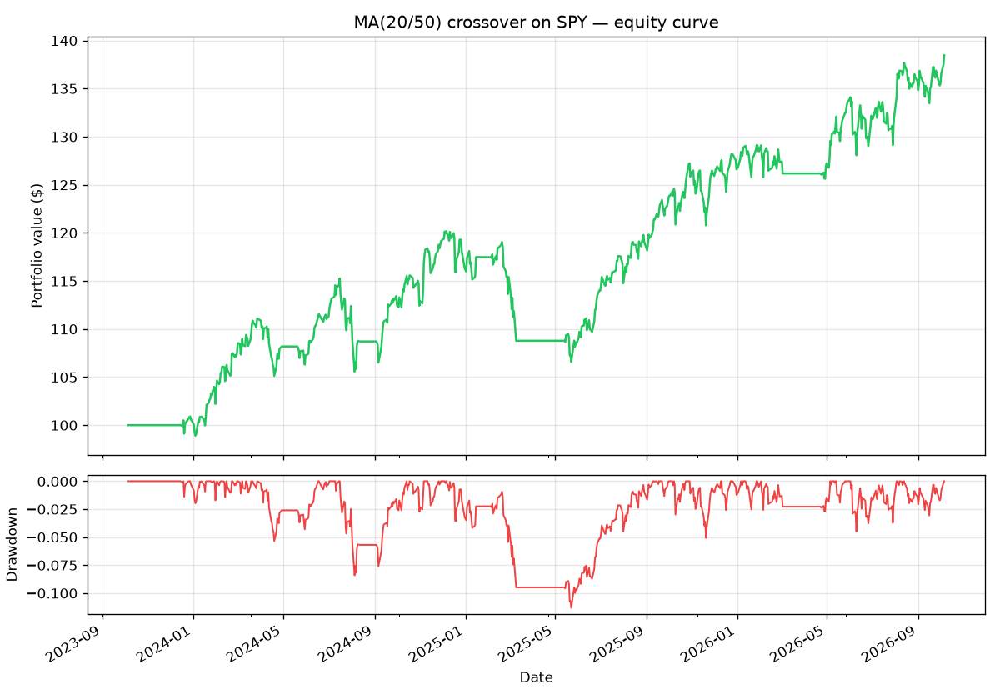

# VectorBT Tutorial: Backtest a Strategy in 30 Minutes

> **📦 Part 1 of [_Build Your Own Quant Research System_](https://github.com/goosos/quant-toolkit)** — follow the series and you'll build a complete, modular research toolkit from scratch, one tutorial at a time.

> **✅ Tested:** vectorbt 1.1.1 · Python 3.12 · yfinance 0.2.40 · Last verified: 2026-10-07 · [Update policy](https://goosos.com/about#freshness)

**Target keyword:** vectorbt tutorial
**Meta description:** Learn VectorBT from scratch: install, download free data, backtest a moving-average crossover strategy, read the tearsheet, and scan thousands of parameters in seconds. Complete runnable code included.

---

If you've ever waited 20 minutes for a backtest to finish scanning 50 parameter combinations, you already know why VectorBT exists.

Most backtesting libraries — backtrader, zipline — are **event-driven**: they simulate the market bar by bar, like replaying history in real time. It's realistic, but it's slow. VectorBT takes the opposite approach: it's **vectorized**. Your entire strategy becomes array operations over pandas Series, compiled by Numba, and 10,000 parameter combinations finish in seconds.

This tutorial takes you from zero to a complete, honest backtest in about 30 minutes:

1. Install VectorBT (v1.1.1, current as of October 2026)
2. Download free market data
3. Backtest a moving-average crossover strategy — full runnable code
4. Read the tearsheet: Sharpe, max drawdown, win rate — what the numbers actually mean
5. Scan thousands of parameters and plot a heatmap
6. Add realistic costs (the step most tutorials skip)
7. Dodge the three traps that silently inflate results

All code in this article is tested and runs end-to-end. The complete scripts live in the companion repo: [goosos/vectorbt-tutorial](https://github.com/goosos/vectorbt-tutorial).

> **Risk note:** Everything here is educational. Backtests are hypothetical — they don't predict future returns, and a good backtest doesn't mean a profitable strategy. Nothing in this article is investment advice.

---

## 1. Why VectorBT (and When Not to Use It)

Three Python backtesting libraries dominate in 2026, and they solve different problems:

| Library | Style | Best for | Status (2026) |
|---|---|---|---|
| **VectorBT** | Vectorized | Research speed: scan thousands of configs in seconds | Active, v1.1.1 |
| **backtrader** | Event-driven | Realistic simulation for strategies headed to live trading | Maintained, v1.9.78 |
| **backtesting.py** | Event-driven, simple API | Gentlest learning curve, single-strategy tests | Active, v0.6.6 |

VectorBT's computation model is well-understood: independent implementations of the same strategies in event-driven engines produce matching fills at declared precision. The difference between the libraries is **how** they compute, not whether the math is trustworthy.

**Use VectorBT when:** you're in the research phase — testing ideas, scanning parameters, comparing indicator settings. Speed is the whole point.

**Don't use VectorBT when:** you need tick-level realism — order book dynamics, partial fills, latency modeling. That's event-driven territory (backtrader), and eventually a paper-trading phase.

One more thing worth knowing upfront: VectorBT's license changed. It's no longer MIT — it's **Fair Code** (Apache 2.0 + Commons Clause). Free for individuals and organizations to use, but you can't sell a product that's primarily VectorBT itself. For learning and research, nothing changes.

---

## 2. Installation

You need **Python 3.11 or newer** (3.10 was dropped in v1.1.0). Then:

```bash
pip install -U vectorbt
```

That's the core. Two optional extras worth knowing:

```bash
pip install -U "vectorbt[full]"   # + TA-Lib, pandas-ta, and friends
pip install -U "vectorbt[rust]"   # Rust engine — skips Numba JIT warmup
```

**Heads-up about the first run:** VectorBT compiles its hot loops with Numba on first use. Your first backtest will pause for ~30–60 seconds while it compiles. Every run after that is fast. This is normal — don't kill the process thinking it hung.

Verify the install:

```python
import vectorbt as vbt
print(vbt.__version__)   # expect 1.1.1 or newer
```

---

## 3. Getting Free Data

VectorBT ships a Yahoo Finance wrapper, which is still the fastest path to real data:

```python
import vectorbt as vbt

data = vbt.YFData.download("SPY")
price = data.get("Close")
print(price.head())
print(f"{len(price)} daily bars")
```

A few notes from experience:

- Yahoo data is free but flaky — if a download fails, `pip install -U yfinance` usually fixes it, or just retry. (Our test script in the repo includes a synthetic-data fallback so the tutorial never hard-crashes on a bad network day.)
- `auto_adjust=True` gives you split/dividend-adjusted closes — use it, or your long-run returns will be wrong.
- Need crypto or multi-symbol? `vbt.YFData.download(["BTC-USD", "ETH-USD"])` returns a DataFrame, and everything below broadcasts across columns automatically. There are also `vbt.BinanceData`, `vbt.CCXTData`, and `vbt.AlpacaData` connectors.

For this tutorial we'll use **3 years of daily SPY** — liquid, long history, no survivorship games.

---

## 4. Your First Backtest: MA Crossover

The strategy couldn't be simpler: **go long SPY when the 20-day moving average crosses above the 50-day, exit when it crosses back below.** It's a trend-following classic — not because it's profitable (spoiler: the results are honest, not miraculous), but because it's the perfect vehicle for learning the machinery.

Here's the complete script. Copy it, run it, it works:

```python
import vectorbt as vbt

# --- 1. Data ---
data = vbt.YFData.download("SPY", period="3y", interval="1d")
price = data.get("Close")

# --- 2. Signals ---
fast_ma = vbt.MA.run(price, 20)
slow_ma = vbt.MA.run(price, 50)

entries = fast_ma.ma_crossed_above(slow_ma)
exits = fast_ma.ma_crossed_below(slow_ma)

# Act on the NEXT bar — see Section 8 for why this line matters
entries = entries.vbt.signals.fshift(1)
exits = exits.vbt.signals.fshift(1)

# --- 3. Backtest ---
pf = vbt.Portfolio.from_signals(
    price, entries, exits,
    fees=0.001,      # 0.1% commission per side — realistic
    freq="1D",        # daily bars: annualizes Sharpe correctly
)

# --- 4. Results ---
print(pf.stats())
```

Run it. On our test machine (October 2026, SPY daily, Oct 2023 → Oct 2026, 752 bars) it printed:

```
Total return : 38.46%
Sharpe ratio : 1.29
Max drawdown : -11.31%
Win rate     : 83.33%  (6 trades)
```

Six trades in three years, 38% total return, Sharpe 1.29. Respectable — and notably *not* the 500%-return fantasy that zero-fee tutorials produce. That's the point: honest inputs, honest outputs.

The chart tells the rest of the story. Add this to plot the equity curve with drawdown:

```python
import matplotlib
matplotlib.use("Agg")  # headless-safe
import matplotlib.pyplot as plt

fig, (ax1, ax2) = plt.subplots(2, 1, figsize=(10, 7),
                               sharex=True,
                               gridspec_kw={"height_ratios": [3, 1]})
pf.value().plot(ax=ax1, lw=1.5)
ax1.set_title("MA(20/50) crossover on SPY — equity curve")
ax1.set_ylabel("Portfolio value ($)")
ax1.grid(alpha=0.3)

pf.drawdown().plot(ax=ax2, color="#ef4444", lw=1.2)
ax2.set_ylabel("Drawdown")
ax2.grid(alpha=0.3)
fig.tight_layout()
fig.savefig("equity.png", dpi=120)
```



*Figure: equity curve (top) and underwater drawdown (bottom) for the MA(20/50) crossover on SPY. Generated by the tutorial script — your numbers will differ slightly depending on the download date.*

---

## 4b. Code Walkthrough: What Each Line Does

If you copied the script and it ran, great. Now let's make sure you understand *why* each part exists — because the next time something breaks, this is the mental model that fixes it.

**Data loading:**

```python
data = vbt.YFData.download("SPY", period="3y", interval="1d")
price = data.get("Close")
```

`YFData.download` is a thin wrapper around yfinance. The result is a Data object; `.get("Close")` pulls the adjusted close as a pandas Series indexed by date. Everything downstream — indicators, signals, portfolio — operates on this Series. If your data has gaps or NaNs, every indicator after it inherits the problem. When in doubt, `price.isna().sum()` first.

**Indicators:**

```python
fast_ma = vbt.MA.run(price, 20)
slow_ma = vbt.MA.run(price, 50)
```

`vbt.MA.run` computes a moving average and returns an Indicator object. The `.ma` attribute holds the actual Series, but you rarely touch it directly — the object exposes signal methods like `.ma_crossed_above()`. Think of it as "indicator + its natural operations" bundled together.

**Signals:**

```python
entries = fast_ma.ma_crossed_above(slow_ma)
exits = fast_ma.ma_crossed_below(slow_ma)
```

These return boolean Series: `True` on bars where the crossover happened. Note what they *don't* contain: no prices, no position sizes, no "how much to buy." VectorBT separates **signal generation** (your strategy logic) from **portfolio simulation** (how signals become trades). This separation is what makes parameter scanning trivial later — you swap the signals, the portfolio engine stays the same.

**The shift:**

```python
entries = entries.vbt.signals.fshift(1)
exits = exits.vbt.signals.fshift(1)
```

Covered in depth in Section 8, but the one-line version: without this, you're trading on information from the future. `.vbt.signals.fshift(1)` is VectorBT's signal-aware shift — it moves signals forward one bar so today's signal trades tomorrow.

**The portfolio:**

```python
pf = vbt.Portfolio.from_signals(
    price, entries, exits,
    fees=0.001,
    freq="1D",
)
```

`from_signals` is the workhorse. It takes your price and signal Series and simulates the entire portfolio: cash, positions, fees, equity curve. The returned `pf` object is your laboratory — every metric, plot, and trade record in the rest of this tutorial comes from it.

> **Try it yourself:** change `fees=0.001` to `fees=0.0` and re-run. Watch the Sharpe change. That delta is the cost of realism.

---

## 5. Reading the Tearsheet: What the Numbers Actually Mean

`pf.stats()` dumps ~25 metrics. Most beginners stare at Total Return and stop. Here's how to read the four that matter, using our real numbers:

**Total Return: 38.46%**
Over three years, that's roughly 11.5% annualized. Sounds fine — until you ask what SPY itself did. Always compare against buy-and-hold: `pf.benchmark_return()` gives you that baseline. A strategy that underperforms buy-and-hold with more complexity isn't a strategy, it's a hobby.

**Sharpe Ratio: 1.29**
Return per unit of volatility, annualized. Rough guide: below 1.0 is noise, 1.0–2.0 is decent, above 2.0 in a real backtest deserves skepticism (or a closer look at the assumptions). Our 1.29 says "this did something right, but it's not magic." Note: Sharpe is only correct because we passed `freq="1D"` — without it, VectorBT can't annualize and the number is silently wrong. More on this in Section 8.

**Max Drawdown: −11.31%**
The worst peak-to-trough loss. This is the number that determines whether you can actually *hold* the strategy. A −11% drawdown is uncomfortable; a −40% drawdown ends most retail accounts psychologically long before it ends mathematically. Drawdown, not return, is what kills strategies in practice.

**Win Rate: 83.33% (5 of 6 trades)**
High win rate, few trades. Don't be seduced: with 6 trades, one loser swings this number by 17 points. Win rate without trade count is marketing. Also check **Profit Factor** (`pf.trades.profit_factor()`) — gross profit divided by gross loss. Above 1.5 is healthy; below 1.2 is fragile.

Three metrics beginners misread most:

1. **Total Return without the benchmark** — always ask "vs. what?"
2. **Sharpe without checking `freq`** — wrong annualization is silent
3. **Win rate without trade count** — 83% of 6 trades means almost nothing; 55% of 600 trades means a lot

Useful accessors for your own exploration:

```python
pf.total_return()        # 0.3846
pf.sharpe_ratio()        # 1.29
pf.max_drawdown()        # -0.1131
pf.trades.win_rate()     # 0.8333
pf.trades.profit_factor()
pf.trades.expectancy()
pf.trades.records_readable  # every trade as a DataFrame
```

**Beyond the big four:** `pf.stats()` also reports Calmar Ratio (annualized return ÷ max drawdown — how much return you got per unit of pain), Omega Ratio (probability-weighted gains vs. losses — captures asymmetry Sharpe misses), and Sortino Ratio (like Sharpe but only penalizes downside volatility). For a first backtest you don't need all three, but know they exist: when Sharpe and Sortino disagree sharply, your returns have a fat downside tail worth investigating.

**Expectancy** deserves a special mention: `pf.trades.expectancy()` tells you the average profit per trade in dollars. Multiply it by your expected trade frequency and you get a rough sense of whether the strategy is worth the operational hassle. A strategy with $2 expectancy that trades twice a year is a curiosity; the same expectancy at 200 trades a year is a business.

---

## 5b. Troubleshooting: Errors You'll Actually Hit

**`TypingError: non-precise type array(pyobject, 1d, C)`**
You built signals with raw pandas and a `.shift(1)`. The NaN at position 0 converted your boolean Series to `object` dtype, and Numba can't compile that. Fix: `.fillna(False).astype(bool)` — or better, use `vbt.MA.run()` and `.vbt.signals.fshift(1)` as this tutorial does.

**First run hangs for ~60 seconds**
That's Numba JIT compilation, not a hang. Go make tea. It only happens once per fresh Python process.

**`yfinance` download returns empty**
Yahoo changes their API every year or two and yfinance breaks for a few days. Run `pip install -U yfinance` first. If you're behind a corporate proxy, the download may fail silently — our repo script falls back to synthetic data with a clear warning so the tutorial never dead-ends.

**Sharpe looks absurdly high (>5)**
You probably forgot `freq`. Without it, VectorBT annualizes on the wrong timescale. Check that `freq` matches your bar size: `"1D"` for daily, `"1h"` for hourly.

**Heatmap shows all NaN**
Your slow window exceeds your data length, or `missing_index="drop"` misaligned multi-symbol data. Print `price.shape` and your window range first.

---

## 6. Parameter Scanning: VectorBT's Killer Feature

Here's where VectorBT earns its keep. Instead of testing one (20, 50) pair, test **every** fast/slow combination from 2 to 100 — 9,801 backtests — in a single pass:

```python
import numpy as np

windows = np.arange(2, 101)
fast_ma, slow_ma = vbt.MA.run_combs(price, window=windows, r=2,
                                    short_names=["fast", "slow"])
entries = fast_ma.ma_crossed_above(slow_ma).vbt.signals.fshift(1)
exits = fast_ma.ma_crossed_below(slow_ma).vbt.signals.fshift(1)

pf = vbt.Portfolio.from_signals(price, entries, exits,
                                fees=0.001, freq="1D")

sharpe = pf.sharpe_ratio()
print("Best:", sharpe.idxmax(), "->", sharpe.max())
```

Then visualize it as a heatmap:

```python
fig = pf.total_return().vbt.heatmap(
    x_level="fast_window", y_level="slow_window",
    trace_kwargs=dict(colorbar=dict(title="Total return")))
fig.show()   # or fig.write_image("heatmap.png")
```

Now read the heatmap like a researcher, not a tourist:

- **A broad plateau** of good parameters (e.g., fast 15–30, slow 40–70 all work) → the edge is probably real. Small changes don't break it.
- **A single sharp peak** surrounded by mediocrity → you've found noise, not signal. That exact (17, 63) combo won't survive contact with new data.

This is the visual intuition behind **overfitting**, and it's the reason our content plan has a dedicated article on it: [Backtest Overfitting, PBO & Deflated Sharpe](/backtest-overfitting-pbo-deflated-sharpe) *(coming next)*. VectorBT even ships a built-in deflated Sharpe ratio — `pf.returns().vbt.returns.deflated_sharpe_ratio(...)` — which penalizes Sharpe for the number of trials you ran. Use it after any grid search.

> **Try it yourself:** change the scan to `np.arange(5, 201, 5)` and see how the plateau shifts. Then add `slippage=0.0005` and watch the best Sharpe drop — that's reality entering the chat.

---

## 7. Costs: The Step Most Tutorials Skip

VectorBT's defaults are `fees=0.0` and `slippage=0.0`. A zero-cost backtest is a fantasy backtest — and it's the default, so most copy-paste tutorials silently publish fantasies.

Our script already sets `fees=0.001` (10 basis points per side — roughly realistic for retail). Watch what happens when you compare:

```python
pf_free = vbt.Portfolio.from_signals(price, entries, exits, freq="1D")
pf_real = vbt.Portfolio.from_signals(price, entries, exits,
                                     fees=0.001, slippage=0.0005, freq="1D")

print(f"Fantasy Sharpe: {pf_free.sharpe_ratio():.2f}")
print(f"Realistic Sharpe: {pf_real.sharpe_ratio():.2f}")
print(f"Fees paid: ${pf_real.stats()['Total Fees Paid']:.2f}")
```

For a low-turnover strategy like ours (6 trades), costs barely dent the result. For a strategy that trades daily, 10bps per side compounds into a massacre. **Rule of thumb:** if adding realistic costs flips your Sharpe from green to red, you never had a strategy — you had a commission-donation plan.

You can also set sensible defaults once, globally:

```python
vbt.settings['portfolio']['fees'] = 0.0005
vbt.settings['portfolio']['slippage'] = 0.0002
```

---

## 7b. Position Sizing: The Multiplier Nobody Talks About

So far our backtest uses VectorBT's default: `size=np.inf`, meaning "use all available cash." That's fine for learning, but position sizing is where real strategies live or die — a great signal with reckless sizing still blows up.

VectorBT gives you precise control:

```python
# Fixed fractional: risk 10% of equity per trade
pf = vbt.Portfolio.from_signals(
    price, entries, exits,
    size=0.10, size_type="percent",
    fees=0.001, freq="1D",
)

# Fixed dollar amount per trade
pf = vbt.Portfolio.from_signals(
    price, entries, exits,
    size=1000, size_type="value",   # $1000 per trade
    fees=0.001, freq="1D",
)
```

The `size_type` options:

| `size_type` | Meaning | When to use it |
|---|---|---|
| `"amount"` (default) | Number of shares/contracts | You think in share counts |
| `"value"` | Dollar value per trade | Fixed-dollar risk |
| `"percent"` | Fraction of current equity | Compounding strategies |
| `"targetpercent"` | Rebalance to target % | Portfolio allocation |

**Why this matters for the tutorial strategy:** our MA crossover with `size=np.inf` goes all-in on every signal. Try `size=0.5, size_type="percent"` — half the capital per trade, the rest in cash. The Sharpe often *improves* because drawdowns shrink faster than returns. That's a free lesson in risk management from one parameter change.

> **Try it yourself:** run the backtest with `size=1.0`, `0.5`, and `0.25` (percent). Plot all three equity curves on one chart. Notice how the shape changes — that's position sizing doing more work than your entry signal.

**A word on leverage:** VectorBT supports it (`leverage` parameter), but this tutorial won't demonstrate it. Leverage multiplies both returns and the speed at which mistakes kill you. Master unleveraged backtesting first.

---

## 8. Three Traps That Silently Inflate Results

### Trap 1: Lookahead bias (the `fshift(1)` line)

VectorBT fills a signal **on the same bar**, at that bar's close, by default. But your signal was computed *from* that bar's close — information you wouldn't have had until the bar ended. Trading on it is time travel.

The fix: shift signals forward one bar (decide at today's close, trade tomorrow), or fill at the open:

```python
entries = entries.vbt.signals.fshift(1)   # our choice
# — or —
pf = vbt.Portfolio.from_signals(price, entries, exits, price=open_price)
```

**Bonus gotcha we hit while testing:** if you write the shift with raw pandas — `(fast_ma > slow_ma).shift(1)` — the `NaN` at position 0 silently converts the boolean Series to `object` dtype, and VectorBT's Numba engine explodes with a cryptic `TypingError`. The fix is `.fillna(False).astype(bool)`. Using `vbt.MA.run()` + `.vbt.signals.fshift(1)` avoids this entirely — another reason to use the library's own signal methods.

### Trap 2: Forgetting `freq`

Without `freq="1D"`, Sharpe, annualized return, and Calmar are computed on the wrong timescale — **silently**. No error, no warning, just wrong numbers. Set it every time. (For hourly bars: `freq="1h"`.)

### Trap 3: The zero-fee default

Covered in Section 7, but it bears repeating because it's the most common sin in VectorBT tutorials online: `from_signals(price, entries, exits)` with no fees, no slippage, no freq. Three missing arguments, three layers of fantasy.

---

## 8b. Putting It Together: A 10-Minute Research Workflow

Here's the workflow this tutorial has been building toward. Next time you have a strategy idea, run this loop:

**Step 1: One clean backtest (5 min)**
Write the simplest version. One asset, one parameter set, realistic fees, `fshift(1)`, `freq` set. If the Sharpe is below 0.5 at this stage, the idea probably isn't worth optimizing — move on.

**Step 2: Parameter scan (2 min)**
Grid-scan the key parameters. Look at the heatmap. Ask: *is there a plateau, or just a peak?* Plateau → proceed. Lone peak → discard; you found noise.

**Step 3: Cost sensitivity (1 min)**
Double the fees and slippage. If the strategy survives, it's robust to your cost estimates being wrong (they will be). If it dies, your edge was thinner than your uncertainty.

**Step 4: Position sizing (2 min)**
Try `size=0.5, size_type="percent"`. Compare Sharpe and max drawdown against all-in. Most beginners are surprised how often half-size wins on risk-adjusted terms.

Total: 10 minutes from idea to a defensible answer. That's the VectorBT superpower — not the library itself, but the **iteration speed** it gives your research process. The strategies that survive this loop earn the right to a walk-forward test (our next tutorial). The ones that don't get discarded in minutes instead of weeks.

> **Try it yourself:** pick a different indicator — RSI, Bollinger Bands, or Donchian channels (all in `vbt.IF` / `vbt.BBANDS` / `vbt.DONCHIAN`). Run the 4-step loop. Time yourself. That's your new research cadence.

---

## 8c. Merge Into the Toolkit: `backtest.py`

This tutorial isn't a standalone trick — it's **Part 1** of a system we're building together. The core logic from this article now lives as the first module of [goosos/quant-toolkit](https://github.com/goosos/quant-toolkit):

```python
from quant_toolkit.backtest import run_backtest, ma_crossover_signals, summary

entries, exits = ma_crossover_signals(price, fast=20, slow=50)
pf = run_backtest(price, entries, exits)
print(summary(pf))
# {'total_return': 0.3846, 'sharpe': 1.29, 'max_drawdown': -0.1131, ...}
```

What changed from the tutorial script? Almost nothing — that's the point:

- `run_backtest()` wraps `vbt.Portfolio.from_signals` with honest defaults (fees, slippage, `freq` always set)
- `ma_crossover_signals()` bundles signal generation + the one-bar shift (no lookahead, ever)
- `summary()` returns the metrics that matter as a plain dict

**Why a toolkit, not just scripts?** Each tutorial in this series adds one module. By Part 10 you'll have `backtest`, `validation`, `overfitting`, `costs`, `sizing`, `data`, and `metrics` — a research system you understand line by line, because you watched every line get written. That's the difference between *using* a library and *owning* your process.

> **Next:** [Part 2: Walk-Forward Analysis](/walk-forward-analysis) adds `validation.py` — testing on data your parameter scan never saw.

---

## 9. Where to Go Next

You now have a complete, honest backtesting workflow — and the first module of your toolkit. Natural next steps:

1. **[Part 2: Walk-Forward Analysis](/walk-forward-analysis)** *(next in series)* — adds `validation.py`: the antidote to overfitting.
2. **Portfolio backtests** — `from_signals` broadcasts across columns, so multi-asset portfolios are nearly free. Try SPY + TLT + GLD.
3. **Stops** — `sl_stop=0.05, tp_stop=0.10` adds stop-loss/take-profit in one line. Measure whether they help or just add churn.
4. **[Part 4: Backtest Overfitting, PBO & Deflated Sharpe](/backtest-overfitting-pbo-deflated-sharpe)** — adds `overfitting.py`: the methodology behind not fooling yourself.

The full code for this tutorial is in [goosos/vectorbt-tutorial](https://github.com/goosos/vectorbt-tutorial). The growing toolkit is in [goosos/quant-toolkit](https://github.com/goosos/quant-toolkit). Clone them, break them, make them yours.

---

## FAQ

**Is VectorBT free?**
Yes for learning and research. The open-source library is free under Fair Code licensing (not MIT anymore — commercial redistribution has restrictions). There's a paid VectorBT Pro with new features, but everything in this tutorial uses the free version.

**Can I use VectorBT for live trading?**
Not directly — it's a research/backtesting library, not a broker connector. The workflow is: research in VectorBT → validate realism in an event-driven engine or paper trading → execute through a broker API.

**VectorBT vs backtrader — which should I learn?**
Learn VectorBT first if your bottleneck is *ideas* (you need to test many). Learn backtrader if your bottleneck is *realism* (your strategy is headed to live trading). They're complements, not rivals.

**Why is the first run so slow?**
Numba JIT compilation (~30–60s once). Subsequent runs are seconds. The `[rust]` extra avoids even that.

**Does `vbt.YFData.download` still work?**
Yes. Yahoo changes their API periodically and yfinance breaks for a few days; `pip install -U yfinance` is the usual fix.

**How do I backtest a portfolio of multiple assets?**
Pass a DataFrame instead of a Series: `vbt.YFData.download(["SPY", "TLT", "GLD"])` gives you multi-column price data, and `from_signals` broadcasts everything automatically. Each column becomes an independent backtest — then use `pf.resample()` or groupby to aggregate.

**Can VectorBT handle intraday/hourly data?**
Yes — set `freq="1h"` (or `"15m"`, etc.) and make sure your signals align to the same index. The vectorized engine doesn't care about bar size; only the annualization math needs the right `freq`.

**What's the difference between `from_signals` and `from_orders`?**
`from_signals` takes boolean entry/exit arrays (what this tutorial uses). `from_orders` takes explicit order sizes — more control, more work. Start with signals; graduate to orders when you need partial position management.

**Why do my results differ from the article's numbers?**
Three reasons: (1) Yahoo data updates — your 3-year window covers different dates; (2) `auto_adjust` settings; (3) VectorBT version. Small differences are normal. Large differences mean something's wrong — check `freq` first.

## References

1. Polakow, O. — [vectorbt GitHub repository](https://github.com/polakowo/vectorbt). Source for API patterns, `Portfolio.from_signals` parameters, and v1.1.1 release notes cited in this tutorial.
2. [VectorBT official documentation](https://vectorbt.dev) — indicator methods (`MA.run`, `run_combs`, `ma_crossed_above`), signal handling (`.vbt.signals.fshift`), and portfolio settings.
3. [vectorbt on PyPI](https://pypi.org/project/vectorbt/) — version history (1.1.1, Sep 2026), Python requirement (≥3.11), and the Fair Code license notice.
4. Bailey, D. H. & López de Prado, M. (2014). "The Deflated Sharpe Ratio: Correcting for Selection Bias, Backtest Overfitting and Non-Normality." *Journal of Portfolio Management*, 40(5), 94–107. [SSRN](https://papers.ssrn.com/sol3/papers.cfm?abstract_id=2460551). The statistical basis for the deflated Sharpe ratio discussed in Section 6.
5. López de Prado, M. (2018). *Advances in Financial Machine Learning*. Wiley. Chapter on backtest overfitting and the PBO framework referenced in our [overfitting article](/backtest-overfitting-pbo-deflated-sharpe).

---

## Further Reading

- [VectorBT official documentation](https://vectorbt.dev) — the API reference behind this tutorial
- [Walk-Forward Analysis](/walk-forward-analysis) — the next Goosos tutorial: testing on unseen data
- [Backtest Overfitting, PBO & Deflated Sharpe](/backtest-overfitting-pbo-deflated-sharpe) — the methodology article on not fooling yourself

---

*Part 1 of [Build Your Own Quant Research System](https://github.com/goosos/quant-toolkit) · Code: [goosos/vectorbt-tutorial](https://github.com/goosos/vectorbt-tutorial) · Toolkit: [goosos/quant-toolkit](https://github.com/goosos/quant-toolkit) · Next: [Part 2: Walk-Forward Analysis](/walk-forward-analysis)*
